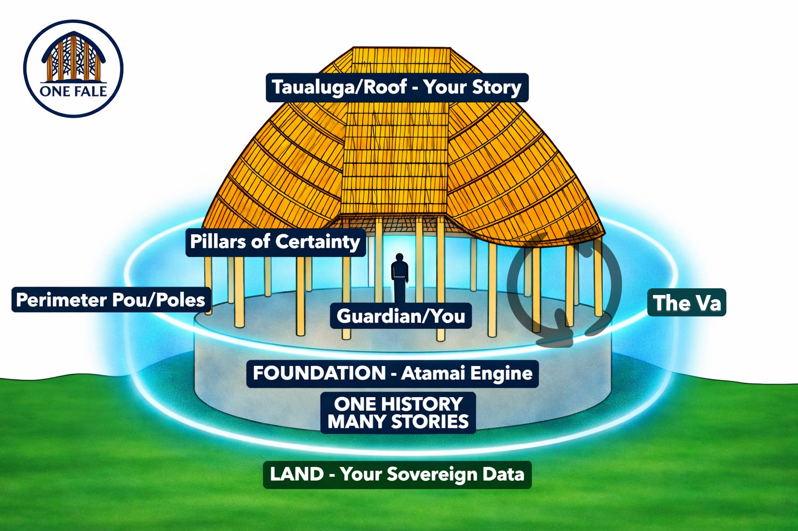

ONE FALE
A sovereign knowledge framework that holds all stories under one roof and finds truth through relationship, not elimination.
> \*"The strength of the Fale is not found in the thickness of the timber, but in our relationships."\*
---

---
About ONE FALE
ONE FALE sits above your Land, your data, your cloud. It does not occupy or colonise it. Through an onboarding invitation protocol, ONE FALE gains access to your data, indexes and maps it, and returns what is not needed back to the Land. You hold the access keys. Always.
This framework emerged directly from the Leifi History Project, a forensic reconstruction of 1,000 years of Samoan family history across both Samoas. It was built out of necessity, and formalised through 18 months of research, legal proceedings, and architectural development in Samoa.
> \*"We don't force a history to fit our tools. We build the tools to fit the history."\*
---
Quick Key Reference Guide
Diagram Label	Term	Description
Taualuga / Roof	Strategic Narrative	The high-integrity protective story. It is the final output of the OHMS cycle, representing the Who, What, Where, When and Why to the outside world.
Pillars of Certainty	10 Governance Pillars	The 10 central structural pillars representing verified truths. They validate knowledge integrity and connect the foundation to the strategic narrative.
Perimeter Pou / Poles	Authoritative Evidence	The 30 external poles representing the Who. They provide the witnesses, evidence, and ancestral weight needed to turn a central pillar to its verified state.
The Va	Relational Space	The sacred, neutral space between data points. It prevents context loss by monitoring reciprocity, balance, and contribution value between the tenant and external systems.
Guardian / You	Sovereign Steward	The human authority sitting at the centre. The Guardian is the final decision-maker responsible for the Fale's restoration and stewardship.
Foundation / ATAMAI Engine	Sovereign Query Engine	A multi-agent AI system that runs the OHMS cycle for forensic truth-building.
Land / Your Sovereign Data	Sovereign Data Bank	The raw, uncolonised data source. The engine maps and indexes this land through an invitation protocol but never occupies it.
---
The OHMS Cycle
One History, Many Stories
OHMS is the founding principle and operating cycle of the ATAMAI Engine.
During onboarding, all narratives are held. None are dismissed. The MAT-AI Council sifts through them to find the core truths and values of a tenant. These core truths form the Pillars of Certainty, the central pillars that hold up the entire structure. Information that is not required is updated and returned to the Land.
The cycle runs as follows:
SAR (Sovereign Archival Retrieval) — The ATAMAI Engine is invited into the Land through the onboarding protocol. It maps and indexes what is there without occupying it.
SAI (Sovereign Archival Interpretation) — The MAT-AI Council cross-references sources, identifies relationships between data points, and surfaces verified truths across competing narratives.
SAA (Sovereign Archival Affirmation) — The Guardian reviews the output. The human overwrite applies. Nothing is affirmed without the Guardian's approval.
---
The 10 Principles
We learn together.
We protect each other.
We guide each other.
We seek truth in all things, big and small, in pursuit of peace.
No doors, many doors.
Sharing is learning; we pass on what we learn.
We respect boundaries; we withdraw, we don't impose.
We honour the ancestors and the next generation.
ONE FALE is timeless, where time is a circle.
We honour the silence, the space between where all things are held.
---
No Colonisation Preamble
ONE FALE does not own, store, or process your data. It maps it, indexing relationships while your data stays exactly where it is. You hold the access keys. Always.
---
Status
ONE FALE is currently in active development. Core framework components are locked. Documentation is being published progressively.
---
Contact
Built in Samoa. Open to the right conversation.
LinkedIn: ONE FALE
A sovereign knowledge framework that holds all stories under one roof and finds truth through relationship, not elimination.
> \*"The strength of the Fale is not found in the thickness of the timber, but in our relationships."\*
---

---
About ONE FALE
ONE FALE sits above your Land, your data, your cloud. It does not occupy or colonise it. Through an onboarding invitation protocol, ONE FALE gains access to your data, indexes and maps it, and returns what is not needed back to the Land. You hold the access keys. Always.
This framework emerged directly from the Leifi History Project, a forensic reconstruction of 1,000 years of Samoan family history across both Samoas. It was built out of necessity, and formalised through 18 months of research, legal proceedings, and architectural development in Samoa.
> \*"We don't force a history to fit our tools. We build the tools to fit the history."\*
---
Quick Key Reference Guide
Diagram Label	Term	Description
Taualuga / Roof	Strategic Narrative	The high-integrity protective story. It is the final output of the OHMS cycle, representing the Who, What, Where, When and Why to the outside world.
Pillars of Certainty	10 Governance Pillars	The 10 central structural pillars representing verified truths. They validate knowledge integrity and connect the foundation to the strategic narrative.
Perimeter Pou / Poles	Authoritative Evidence	The 30 external poles representing the Who. They provide the witnesses, evidence, and ancestral weight needed to turn a central pillar to its verified state.
The Va	Relational Space	The sacred, neutral space between data points. It prevents context loss by monitoring reciprocity, balance, and contribution value between the tenant and external systems.
Guardian / You	Sovereign Steward	The human authority sitting at the centre. The Guardian is the final decision-maker responsible for the Fale's restoration and stewardship.
Foundation / ATAMAI Engine	Sovereign Query Engine	A multi-agent AI system that runs the OHMS cycle for forensic truth-building.
Land / Your Sovereign Data	Sovereign Data Bank	The raw, uncolonised data source. The engine maps and indexes this land through an invitation protocol but never occupies it.
---
The OHMS Cycle
One History, Many Stories
OHMS is the founding principle and operating cycle of the ATAMAI Engine.
During onboarding, all narratives are held. None are dismissed. The MAT-AI Council sifts through them to find the core truths and values of a tenant. These core truths form the Pillars of Certainty, the central pillars that hold up the entire structure. Information that is not required is updated and returned to the Land.
The cycle runs as follows:
SAR (Sovereign Archival Retrieval) — The ATAMAI Engine is invited into the Land through the onboarding protocol. It maps and indexes what is there without occupying it.
SAI (Sovereign Archival Interpretation) — The MAT-AI Council cross-references sources, identifies relationships between data points, and surfaces verified truths across competing narratives.
SAA (Sovereign Archival Affirmation) — The Guardian reviews the output. The human overwrite applies. Nothing is affirmed without the Guardian's approval.
---
The 10 Principles
We learn together.
We protect each other.
We guide each other.
We seek truth in all things, big and small, in pursuit of peace.
No doors, many doors.
Sharing is learning; we pass on what we learn.
We respect boundaries; we withdraw, we don't impose.
We honour the ancestors and the next generation.
ONE FALE is timeless, where time is a circle.
We honour the silence, the space between where all things are held.
---
No Colonisation Preamble
ONE FALE does not own, store, or process your data. It maps it, indexing relationships while your data stays exactly where it is. You hold the access keys. Always.
---
Status
ONE FALE is currently in active development. Core framework components are locked. Documentation is being published progressively.
---
Contact
Built in Samoa. Open to the right conversation.
LinkedIn: Steve Leifi
GitHub: https://github.com/one-fale
steve.leifi@gmail.com
---
Ua fofola fala, ua sau le malaga. The mats are spread. The travelers have arrived.
GitHub: https://github.com/one-fale
steve.leifi@gmail.com
---
Ua fofola fala, ua sau le malaga. The mats are spread. The travelers have arrived.
